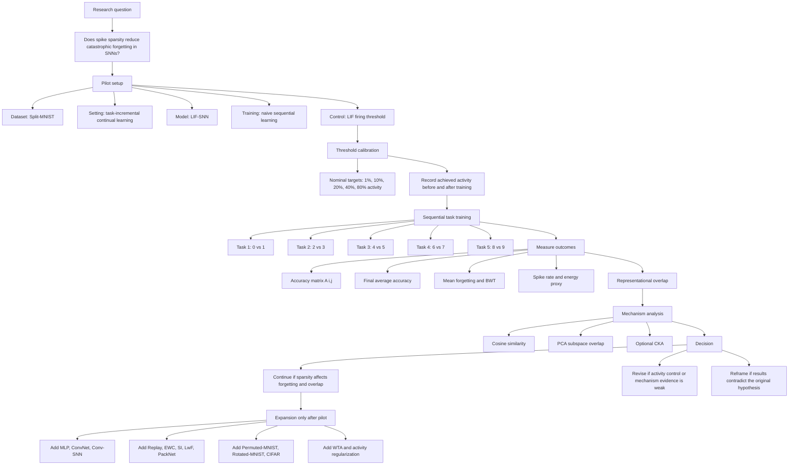
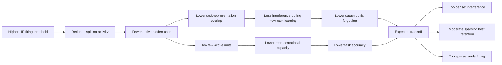
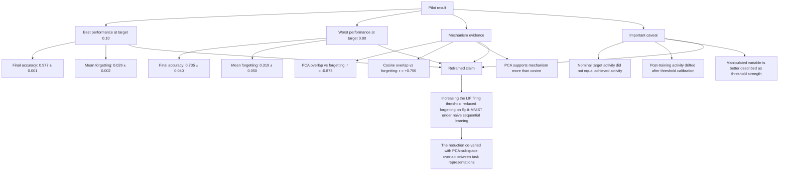
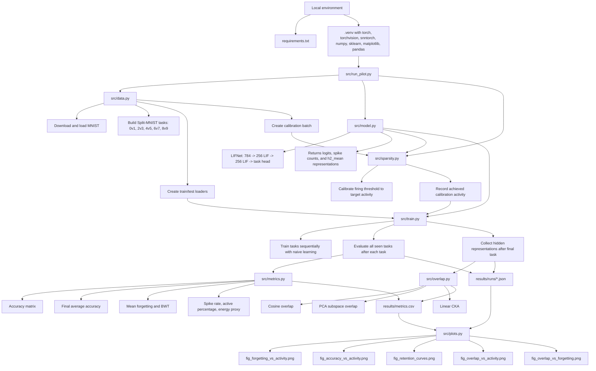

# Research pipeline and hypothesis diagram

This file gives an editable diagram view of the project. The first diagram shows the experiment pipeline. The second diagram shows the causal hypothesis. The third diagram shows what the pilot actually found and how the claim should be framed.

## 1. Research pipeline

## 2. Hypothesis mechanism

## 3. Pilot result interpretation

## 4. Codebase flow

This diagram shows the implementation path. `run_pilot.py` is the orchestrator. It calls the data loader, model, threshold calibration, sequential training loop, metrics module, and overlap module. It writes the numeric outputs to `results/metrics.csv` and the per-run accuracy matrices to `results/runs/*.json`. `plots.py` then reads those files and produces the five pilot figures.

## 5. Caption for paper or slides

The study tests whether spike sparsity reduces catastrophic forgetting by lowering overlap between task representations. The pilot uses Split-MNIST, a task-incremental LIF-SNN, naive sequential learning, and threshold-controlled spiking activity. After each task, the model is evaluated on all previously seen tasks to build an accuracy matrix and compute forgetting. Hidden-layer spike representations are then compared across tasks using cosine similarity and PCA subspace overlap. The first pilot supports continuing the project, but with a narrower claim: threshold strength, rather than precisely controlled achieved activity, is the cleanest manipulated variable in the current implementation.

## 6. Notes for the next version

- Fix activity control before expanding the experiment grid. The nominal activity target did not map cleanly to post-training achieved activity.
- Treat PCA subspace overlap as the stronger mechanism signal for now. Cosine similarity gave a contradictory trend.
- Keep the claim bounded to Split-MNIST, naive sequential learning, and LIF-SNNs until the expanded experiments are complete.
- Do not claim that SNNs solve catastrophic forgetting or that spike-count energy proxies prove hardware energy efficiency.
